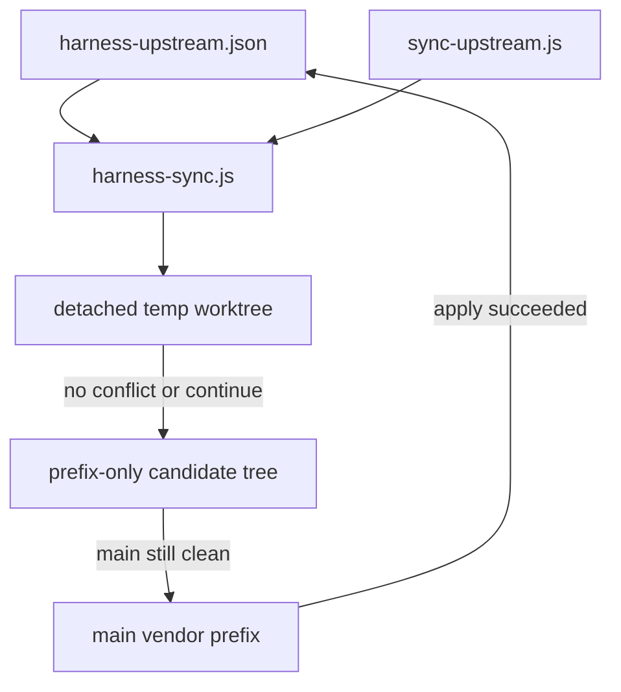

# Harness rc.7 Vendor Pin Implementation Plan

> **For agentic workers:** REQUIRED SUB-SKILL: Use superpowers:subagent-driven-development (recommended) or superpowers:executing-plans. Steps use checkbox (`- [ ]`) syntax for tracking. This plan implements the already-approved design; it does not reopen pin/ref/sync-strategy decisions.

**Goal:** Pin vendored DeepSeek Harness to `dsh-v0.1.0-rc.7` (`99f6f02fecdb7dff40c3fbc9470f5907c29f74ca`), replace broken `git subtree pull --squash` with an isolated-worktree three-way merge, and make source / npx / node-pty / pack assertions read the same pin.

**Architecture:** `vendor/harness-upstream.json` (outside the vendor prefix) records the currently integrated official baseline. The syncer builds a synthetic ours commit whose parent is `pin.sha`, merges the target SHA in a detached worktree, then grafts only `vendor/deepseek-harness/` onto HEAD. Pin updates only after that graft succeeds. Desktop forks stay inside vendor; no overlay extraction.

**Tech Stack:** Node.js CommonJS (`node:test`, `spawnSync` git), existing `npm test` glob `src/**/*.test.js`, desktop pnpm `11.8.0`, Electron 43, official tag `dsh-v0.1.0-rc.7`.

**Spec:** [docs/superpowers/specs/2026-08-18-harness-rc7-vendor-pin-design.md](docs/superpowers/specs/2026-08-18-harness-rc7-vendor-pin-design.md) (Task 1 writes it from the approved design). Durable copy of this plan: [docs/superpowers/plans/2026-08-18-harness-rc7-vendor-pin.md](docs/superpowers/plans/2026-08-18-harness-rc7-vendor-pin.md).

## Global Constraints

- Target: `ref=dsh-v0.1.0-rc.7`, `sha=99f6f02fecdb7dff40c3fbc9470f5907c29f74ca`. Fetch must peel the tag and refuse a SHA mismatch.
- Current baseline pin (written first, before any rc.7 apply): `ref=sha=47f943859bef60e4160492346772ded9b24f765a`, `npm=0.1.0-rc.5`.
- First-pin witness: `47f9438^{tree}` must equal `d2df50d17fdca6547e14264efc2cf4fc526e9a7a^{tree}`.
- Remote preference: existing `upstream-harness`; otherwise `pin.repo` (`https://github.com/deepseek-ai/deepseek-harness.git`).
- No default `master`. No `git subtree pull --squash`. No `--allow-unrelated-histories`. No `git replace` on the main worktree. No auto-commit. No destructive reset as the happy path.
- npm version is read from the target commit's `apps/cli/package.json`, never sliced from the tag name.
- Desktop `package.json` version stays `0.2.3`. `optionalDependencies.node-pty` becomes exact `1.2.0-beta.15`. `build.npmRebuild` stays `false`.
- Vendor `packageManager` stays `pnpm@11.8.0`. Desktop root supplies that pnpm.
- Conflict pause must leave the main index/worktree/pin untouched. `--abort` deletes temp worktree, `.git/dsh-harness-sync.json`, and `refs/backup/harness-pre-sync`.
- Backup ref stays until verification finishes; then clean worktree/state/backup.
- npx fallback is official `@deepseek-ai/dsh@${pin.npm}` and has no desktop 16-package UI. Source/packaged paths keep titlebar/Git/surfaces/terminal.
- Do not run user-invoked `dsh-translate-docs`. Only touch bilingual docs this change actually edits.

## File structure

- Create: `docs/superpowers/specs/2026-08-18-harness-rc7-vendor-pin-design.md` — frozen decisions, pin schema, sync algorithm, 16-package + composition preserve list.
- Create: `docs/superpowers/plans/2026-08-18-harness-rc7-vendor-pin.md` — this implementation plan.
- Create: `vendor/harness-upstream.json` — current official baseline (rc.5 first; rc.7 only after apply).
- Create: `src/shared/harness-upstream.js` / `.test.js` — pin parse/read/write, SHA peel, npm version from a git tree.
- Create: `src/shared/harness-sync.js` / `.test.js` — isolated-worktree merge, continue/abort, prefix-only apply.
- Create: `src/shared/harness-desktop-forks.js` / `.test.js` — machine check for desktop packages + composition row ids.
- Modify: `scripts/sync-upstream.js` — thin argv CLI over `harness-sync`.
- Modify: `scripts/setup-harness.js` — clone `--branch pin.ref`, checkout/verify `pin.sha`.
- Modify: `src/main/dsh.js`, `src/main/dsh.test.js` — npx `@deepseek-ai/dsh@${pin.npm}`; Node error text `22.19+ / 24+`.
- Modify: `scripts/after-pack.js`, `src/main/after-pack.test.js` — assert `pin.npm` on vendor root + `apps/cli/package.json`; probe node-pty prebuild.
- Modify: `package.json` / `package-lock.json` — exact `node-pty@1.2.0-beta.15`.
- Modify: `README.md`, `README.en.md` — `sync:harness -- --ref --sha`; current pin; npx has no desktop extensions.



---

### Task 1: Write the spec and durable plan

**Files:**
- Create: `docs/superpowers/specs/2026-08-18-harness-rc7-vendor-pin-design.md`
- Create: `docs/superpowers/plans/2026-08-18-harness-rc7-vendor-pin.md`

**Interfaces:**
- Consumes: approved design in the existing Cursor plan (pin semantics, isolated-worktree algorithm, 16 packages, 7 composition hunks, lockfile/node-pty, shell alignment, verification).
- Produces: spec sections `Pin`, `Sync algorithm`, `Desktop forks`, `Lockfile and node-pty`, `Shell alignment`, `Verification`, `Out of scope`. Plan header must include Goal / Architecture / Tech Stack / Spec / Global Constraints.

- [ ] **Step 1: Write the spec**

Copy locked values verbatim. Required constants:

```json
{
  "repo": "https://github.com/deepseek-ai/deepseek-harness.git",
  "ref": "47f943859bef60e4160492346772ded9b24f765a",
  "sha": "47f943859bef60e4160492346772ded9b24f765a",
  "npm": "0.1.0-rc.5"
}
```

Target after apply: `ref=dsh-v0.1.0-rc.7`, `sha=99f6f02fecdb7dff40c3fbc9470f5907c29f74ca`, `npm` from that commit's `apps/cli/package.json`.

One physical line per paragraph. No implementation-status narration.

- [ ] **Step 2: Copy this implementation plan into `docs/superpowers/plans/2026-08-18-harness-rc7-vendor-pin.md`**

Keep checkbox syntax. Do not start code until this file exists.

- [ ] **Step 3: Ask for the first checkpoint commit**

Only after the user authorizes:

```bash
git add docs/superpowers/specs/2026-08-18-harness-rc7-vendor-pin-design.md docs/superpowers/plans/2026-08-18-harness-rc7-vendor-pin.md
git commit -m "$(cat <<'EOF'
Document the rc.7 vendor pin and isolated-worktree sync design.

EOF
)"
```

On Windows PowerShell, pass the message as a single `-m` string instead of a bash heredoc.

---

### Task 2: Pin module (TDD)

**Files:**
- Create: `src/shared/harness-upstream.js`
- Test: `src/shared/harness-upstream.test.js`
- Create (in Task 5, not here): `vendor/harness-upstream.json`

**Interfaces:**
- Consumes: none
- Produces:

```js
/** @typedef {{ repo: string, ref: string, sha: string, npm: string }} HarnessPin */

const PIN_RELATIVE = 'vendor/harness-upstream.json'
const DEFAULT_REPO = 'https://github.com/deepseek-ai/deepseek-harness.git'
const RC5_SHA = '47f943859bef60e4160492346772ded9b24f765a'
const SQUASH_WITNESS = 'd2df50d17fdca6547e14264efc2cf4fc526e9a7a'
const FULL_SHA = /^[0-9a-f]{40}$/

function parsePin(text) // throws on missing keys, extra keys, non-40 sha, empty npm
function readPin(rootDir, io = fs)
function writePin(rootDir, pin, io = fs) // writes JSON + trailing newline; atomic via tmp+rename
function assertFullSha(value)
function peelToCommit(git, spec) // git rev-parse `${spec}^{commit}`
function readNpmVersion(git, commitSha) // git show `${commitSha}:apps/cli/package.json` -> version
function assertRc5Witness(git, pin) // only when pin.sha === RC5_SHA: pin.sha^{tree} === SQUASH_WITNESS^{tree}
```

- [ ] **Step 1: Write the failing tests**

```js
const { test } = require('node:test');
const assert = require('node:assert/strict');
const fs = require('node:fs');
const os = require('node:os');
const path = require('node:path');
const { parsePin, readPin, writePin, assertFullSha } = require('./harness-upstream');

test('parsePin accepts the rc.5 pin and rejects a short sha', () => {
  const pin = parsePin(JSON.stringify({
    repo: 'https://github.com/deepseek-ai/deepseek-harness.git',
    ref: '47f943859bef60e4160492346772ded9b24f765a',
    sha: '47f943859bef60e4160492346772ded9b24f765a',
    npm: '0.1.0-rc.5',
  }));
  assert.equal(pin.npm, '0.1.0-rc.5');
  assert.throws(() => parsePin(JSON.stringify({
    repo: 'https://github.com/deepseek-ai/deepseek-harness.git',
    ref: 'master',
    sha: '47f9438',
    npm: '0.1.0-rc.5',
  })), /40/);
});

test('writePin does not leave a partial file when rename target is prepared', (t) => {
  const root = fs.mkdtempSync(path.join(os.tmpdir(), 'pin-'));
  t.after(() => fs.rmSync(root, { recursive: true, force: true }));
  fs.mkdirSync(path.join(root, 'vendor'));
  const pin = {
    repo: 'https://github.com/deepseek-ai/deepseek-harness.git',
    ref: '47f943859bef60e4160492346772ded9b24f765a',
    sha: '47f943859bef60e4160492346772ded9b24f765a',
    npm: '0.1.0-rc.5',
  };
  writePin(root, pin);
  assert.deepEqual(readPin(root), pin);
});
```

Also test: extra keys throw; missing `npm` throws; `assertFullSha('99f6f02fecdb7dff40c3fbc9470f5907c29f74ca')` returns the same string.

- [ ] **Step 2: Run to verify fail**

```powershell
node --test src/shared/harness-upstream.test.js
```

Expected: `Cannot find module` or `parsePin is not a function`.

- [ ] **Step 3: Minimal implementation**

CommonJS, no git network. `writePin` must `mkdir` `vendor/` and write UTF-8 JSON with 2-space indent and one trailing newline.

- [ ] **Step 4: Run to verify pass**

```powershell
node --test src/shared/harness-upstream.test.js
```

Expected: PASS.

---

### Task 3: Isolated-worktree syncer (TDD in a temp git repo)

**Files:**
- Create: `src/shared/harness-sync.js`
- Test: `src/shared/harness-sync.test.js`

**Interfaces:**
- Consumes: `parsePin`, `readPin`, `writePin`, `assertFullSha`, `peelToCommit`, `readNpmVersion`, `assertRc5Witness`
- Produces:

```js
const PREFIX = 'vendor/deepseek-harness'
const STATE_RELATIVE = 'dsh-harness-sync.json' // under gitDir
const BACKUP_REF = 'refs/backup/harness-pre-sync'

/** @typedef {{ mode: 'sync'|'continue'|'abort', ref?: string, sha?: string, dryRun?: boolean }} SyncArgs */
/** @typedef {{ status: 'applied'|'conflict'|'aborted'|'dry-run', worktree?: string, conflicts?: string[], pin?: object }} SyncResult */

function parseSyncArgs(argv)
function syncHarness({ root, args, git = realGit, io = fs })
```

CLI mapping (no default ref):

- `['--ref', 'dsh-v0.1.0-rc.7', '--sha', '99f6f02fecdb7dff40c3fbc9470f5907c29f74ca']` → `{ mode: 'sync', ref, sha }`
- missing `--ref` or `--sha` in `sync` mode throws
- `--continue` / `--abort` / `--dry-run` as exclusive modes (`--dry-run` still requires `--ref` and `--sha`)

Algorithm (must match spec):

1. Refuse unless `git status --porcelain` is empty (tracked + untracked).
2. `git update-ref refs/backup/harness-pre-sync HEAD`.
3. Fetch via `upstream-harness` if that remote exists, else `pin.repo`. Peel `${ref}^{commit}` and require equality with `--sha`.
4. If `pin.sha === RC5_SHA`, run `assertRc5Witness`.
5. `oursTree = git rev-parse HEAD:vendor/deepseek-harness`; `synthetic = git commit-tree oursTree -p pin.sha -m 'dsh-harness-sync synthetic ours'`.
6. `git worktree add --detach <gitDir>/dsh-harness-sync-worktree synthetic`.
7. In that worktree: `git merge --no-commit --no-ff <targetSha>`.
8. Conflict: write `.git/dsh-harness-sync.json` `{ worktree, backupRef, targetRef, targetSha, syntheticOurs, pinBefore }`, return `{ status: 'conflict' }`. Main index/worktree/pin unchanged.
9. Clean merge or `--continue` after user `git add`: `mergedTree = git write-tree` in the worktree.
10. Build candidate with a temp `GIT_INDEX_FILE`: `read-tree HEAD`, `rm -r --cached vendor/deepseek-harness`, `read-tree --prefix=vendor/deepseek-harness/ mergedTree`, `write-tree`.
11. `git diff-tree --name-only HEAD <candidate>` must be only paths under `vendor/deepseek-harness/`. Print it.
12. Re-check main still clean. Then `git checkout <candidate> -- vendor/deepseek-harness`.
13. `writePin` with `{ repo: pin.repo, ref: args.ref, sha: args.sha, npm: readNpmVersion(git, args.sha) }`.
14. `--dry-run` stops before step 12, deletes the temp worktree, does not write state or pin, returns `{ status: 'dry-run' }`.
15. `--abort`: remove worktree, delete state and backup ref; pin/main unchanged.
16. Success path does **not** delete the backup ref (Task 11 does, after verification).

- [ ] **Step 1: Write failing integration tests in a disposable repo**

Helper builds: commit A (upstream base file `keep.txt=base`), commit B (upstream changes `keep.txt=theirs` + `new.txt`), local root commit with `vendor/deepseek-harness/keep.txt=ours` and `desktop-only.txt=local`, plus `vendor/harness-upstream.json` pointing at A.

Required cases:

- happy path: only `vendor/deepseek-harness/**` and the pin file change; pin.sha becomes B; `desktop-only.txt` remains; a sibling `untouched.txt` at repo root is unchanged
- conflict: main porcelain stays empty; pin still A; state file exists; worktree path printed
- `--continue` after resolving `keep.txt` to `merged`: pin becomes B
- `--abort` after conflict: no worktree, no state, pin still A
- `sync` without `--sha` throws and does not fetch
- dirty main throws before creating a worktree

```js
test('conflict leaves the main tree and pin untouched', () => {
  const repo = makeConflictRepo(); // A vs local vs B all edit keep.txt
  const before = readPin(repo);
  const result = syncHarness({
    root: repo,
    args: { mode: 'sync', ref: resultTargetRef(repo), sha: resultTargetSha(repo) },
  });
  assert.equal(result.status, 'conflict');
  assert.deepEqual(readPin(repo), before);
  assert.equal(git(repo, ['status', '--porcelain']).stdout.trim(), '');
});
```

- [ ] **Step 2: Run to verify fail**

```powershell
node --test src/shared/harness-sync.test.js
```

Expected: `Cannot find module './harness-sync'`.

- [ ] **Step 3: Implement `parseSyncArgs` + `syncHarness`**

Use `spawnSync('git', args, { cwd, encoding: 'utf8', shell: false })`. Never `shell: true`. Worktree path must live under `git rev-parse --git-dir`, not the user-visible root.

- [ ] **Step 4: Run to verify pass**

```powershell
node --test src/shared/harness-upstream.test.js src/shared/harness-sync.test.js
```

Expected: PASS.

---

### Task 4: Desktop-fork machine check (TDD)

**Files:**
- Create: `src/shared/harness-desktop-forks.js`
- Test: `src/shared/harness-desktop-forks.test.js`

**Interfaces:**
- Consumes: none
- Produces:

```js
const DESKTOP_PACKAGES = [
  { dir: 'packages/client/ui-agents-panel', name: '@deepseek-ai/dsh-client-ui-agents-panel' },
  { dir: 'packages/client/ui-diff', name: '@deepseek-ai/dsh-client-ui-diff' },
  { dir: 'packages/client/ui-files', name: '@deepseek-ai/dsh-client-ui-files' },
  { dir: 'packages/client/ui-git', name: '@deepseek-ai/dsh-client-ui-git' },
  { dir: 'packages/client/ui-message-edit', name: '@deepseek-ai/dsh-client-ui-message-edit' },
  { dir: 'packages/client/ui-preview', name: '@deepseek-ai/dsh-client-ui-preview' },
  { dir: 'packages/client/ui-settings-mcp', name: '@deepseek-ai/dsh-client-ui-settings-mcp' },
  { dir: 'packages/client/ui-settings-remote', name: '@deepseek-ai/dsh-client-ui-settings-remote' },
  { dir: 'packages/client/ui-settings-skills', name: '@deepseek-ai/dsh-client-ui-settings-skills' },
  { dir: 'packages/client/ui-surfaces', name: '@deepseek-ai/dsh-client-ui-surfaces' },
  { dir: 'packages/client/ui-titlebar', name: '@deepseek-ai/dsh-client-ui-titlebar' },
  { dir: 'packages/client/ui-user-terminal', name: '@deepseek-ai/dsh-client-ui-user-terminal' },
  { dir: 'packages/host/mcp-servers', name: '@deepseek-ai/dsh-host-mcp-servers' },
  { dir: 'packages/host/skill-inventory', name: '@deepseek-ai/dsh-host-skill-inventory' },
  { dir: 'packages/llm/llm-vision-fallback', name: '@deepseek-ai/dsh-llm-vision-fallback' },
  { dir: 'packages/mcp/mcp-servers-file', name: '@deepseek-ai/dsh-mcp-servers-file' },
  { dir: 'packages/client/ui-directory-picker-browse', name: '@deepseek-ai/dsh-client-ui-directory-picker-browse' },
  { dir: 'packages/host/directory-picker-browse', name: '@deepseek-ai/dsh-host-directory-picker-browse' },
]

const COMPOSITION_ROWS = [
  { file: 'packages/bundle/base/cordis.patch.yml', id: 'llm-vision-fallback', name: '@deepseek-ai/dsh-llm-vision-fallback', configIncludes: ['maxOutputTokens: 2048', 'timeoutMs: 120000'] },
  { file: 'packages/bundle/base/cordis.patch.yml', id: 'mcp-servers-file', name: '@deepseek-ai/dsh-mcp-servers-file' },
  { file: 'packages/bundle/web-app/cordis.patch.yml', id: 'directory-picker', name: '@deepseek-ai/dsh-host-directory-picker-browse' },
  { file: 'packages/bundle/web-app/cordis.patch.yml', id: 'mcp-servers', name: '@deepseek-ai/dsh-host-mcp-servers' },
  { file: 'packages/bundle/web-app/cordis.patch.yml', id: 'skill-inventory', name: '@deepseek-ai/dsh-host-skill-inventory' },
  { file: 'packages/bundle/web-app/cordis.patch.yml', id: 'ui-titlebar', name: '@deepseek-ai/dsh-client-ui-titlebar' },
  { file: 'packages/bundle/web-app/cordis.patch.yml', id: 'ui-git', name: '@deepseek-ai/dsh-client-ui-git' },
  { file: 'packages/bundle/web-app/cordis.patch.yml', id: 'ui-user-terminal', name: '@deepseek-ai/dsh-client-ui-user-terminal' },
  { file: 'packages/bundle/web-app/cordis.patch.yml', id: 'ui-surfaces', name: '@deepseek-ai/dsh-client-ui-surfaces' },
  { file: 'packages/bundle/web-app/cordis.patch.yml', id: 'ui-files', name: '@deepseek-ai/dsh-client-ui-files' },
  { file: 'packages/bundle/web-app/cordis.patch.yml', id: 'ui-diff', name: '@deepseek-ai/dsh-client-ui-diff' },
  { file: 'packages/bundle/web-app/cordis.patch.yml', id: 'ui-preview', name: '@deepseek-ai/dsh-client-ui-preview' },
  { file: 'packages/bundle/web-app/cordis.patch.yml', id: 'ui-agents-panel', name: '@deepseek-ai/dsh-client-ui-agents-panel' },
  { file: 'packages/bundle/web-app/cordis.patch.yml', id: 'ui-settings-mcp', name: '@deepseek-ai/dsh-client-ui-settings-mcp' },
  { file: 'packages/bundle/web-app/cordis.patch.yml', id: 'ui-settings-skills', name: '@deepseek-ai/dsh-client-ui-settings-skills' },
  { file: 'packages/bundle/web-app/cordis.patch.yml', id: 'ui-message-edit', name: '@deepseek-ai/dsh-client-ui-message-edit' },
  { file: 'packages/bundle/web-app/cordis.patch.yml', id: 'ui-directory-picker-browse', name: '@deepseek-ai/dsh-client-ui-directory-picker-browse' },
]

function assertDesktopForks(vendorRoot, npmVersion)
```

`assertDesktopForks` also requires: each package `version === npmVersion`; `packages/bundle/web-app/package.json` lists every `name`; `tsconfig.client.json` contains each `packages/client/*` path that is a client package; `ui-settings-remote` may be commented in the patch file but the package directory must exist; layout source still mentions `surfaces`, `shell.titlebar.trailing`, `shell.terminalDrawer`; `scoped-slots.tsx` still binds `session-maybe` with `''`.

- [ ] **Step 1: Write failing tests against a tiny fixture tree, plus one live test against current `vendor/deepseek-harness` with `npmVersion=0.1.0-rc.5`**

The live test proves the checker accepts today's tree. The fixture test proves a missing `ui-titlebar` throws `/ui-titlebar/`.

- [ ] **Step 2: Run to verify fail**

```powershell
node --test src/shared/harness-desktop-forks.test.js
```

- [ ] **Step 3: Implement the checker**

Anchor composition by `id:` / `name:` lines, never by line numbers.

- [ ] **Step 4: Run to verify pass**

```powershell
node --test "src/shared/*.test.js"
```

---

### Task 5: CLI + first pin file + setup-harness

**Files:**
- Create: `vendor/harness-upstream.json` (rc.5 values from Task 2)
- Modify: `scripts/sync-upstream.js` — replace subtree pull with:

```js
const { parseSyncArgs, syncHarness } = require('../src/shared/harness-sync');
const args = parseSyncArgs(process.argv.slice(2));
const result = syncHarness({ root: path.join(__dirname, '..'), args });
if (result.status === 'conflict') process.exit(2);
if (result.status === 'aborted' || result.status === 'dry-run' || result.status === 'applied') process.exit(0);
process.exit(1);
```

- Modify: `scripts/setup-harness.js` — if `vendor/deepseek-harness/package.json` is missing:

```js
const pin = readPin(root);
run('git', ['clone', '--depth', '1', '--branch', pin.ref, pin.repo, vendor], root);
const head = spawnSync('git', ['rev-parse', 'HEAD'], { cwd: vendor, encoding: 'utf8' }).stdout.trim();
if (head !== pin.sha) {
  console.error(`setup:harness HEAD ${head} != pin.sha ${pin.sha}`);
  process.exit(1);
}
```

Existing tree: only `pnpm install --frozen-lockfile` + `pnpm run build`. Do not clone `master`.

- [ ] **Step 1: Write pin file and rewrite the two scripts**
- [ ] **Step 2: Run**

```powershell
npm test
node scripts/sync-upstream.js
```

Expected: `npm test` PASS. Bare `sync-upstream.js` exits non-zero because `--ref`/`--sha` are required (proves master default is gone).

- [ ] **Step 3: Request checkpoint commit** (syncer + rc.5 pin only; vendor tree still rc.5)

---

### Task 6: Dry-run rc.7 (main worktree stays clean)

**Files:** none on `main` except a generated report you may write under `docs/superpowers/` if useful.

- [ ] **Step 1: Confirm main is clean, then dry-run**

```powershell
npm run sync:harness -- --dry-run --ref dsh-v0.1.0-rc.7 --sha 99f6f02fecdb7dff40c3fbc9470f5907c29f74ca
git status --porcelain
```

Expected: report of name-status vs `47f9438` (~944 paths) and real conflicts. `git status` empty. pin still rc.5.

- [ ] **Step 2: Classify every conflict into preserve-ours / take-theirs / hand-merge using the spec lists. Stop and show the user the conflict inventory before Task 7.**

Do not apply the candidate tree in this task.

---

### Task 7: Merge rc.7 (checkpoint — needs commit authorization before running)

**Files (expected conflict / preserve set):**
- `vendor/deepseek-harness/packages/bundle/web-app/cordis.patch.yml`
- `vendor/deepseek-harness/packages/bundle/web-app/package.json`
- `vendor/deepseek-harness/packages/bundle/base/cordis.patch.yml`
- `vendor/deepseek-harness/packages/client/ui-layout/src/client/index.ts`
- `vendor/deepseek-harness/packages/client/web-react/src/scoped-slots.tsx`
- `vendor/deepseek-harness/packages/client/ui-settings-plugins/src/client/index.ts` — take rc.7 keyed card ledger; do not restore list+id
- `vendor/deepseek-harness/pnpm-lock.yaml` — take rc.7, then re-add 18 desktop importers
- `vendor/deepseek-harness/pnpm-workspace.yaml` — `patchedDependencies` key becomes `node-pty@1.2.0-beta.15`
- Generated catalogs (`slot-catalog`, notices, module graph): regenerate after source is stable; do not hand-merge
- `scripts/release/*.ts`: restore official rc.7 files (9 deletes)
- `AppearanceRow` pair: keep deleted only if `AppearanceSection` tests still pass

- [ ] **Step 1: Ask the user for authorization to dirty the vendor tree. If declined, stop.**
- [ ] **Step 2: Run real sync**

```powershell
npm run sync:harness -- --ref dsh-v0.1.0-rc.7 --sha 99f6f02fecdb7dff40c3fbc9470f5907c29f74ca
```

- [ ] **Step 3: If conflict, resolve in the printed worktree only; `git add` there; then**

```powershell
npm run sync:harness -- --continue
```

Preserve rules: 18 package dirs stay; seven composition intents stay (row id anchors); `ui-layout` keeps `surfaces` / `shell.titlebar.trailing` / `shell.terminalDrawer`; `session-maybe` empty-key binding stays; settings cards stay keyed.

- [ ] **Step 4: Lockfile**

```powershell
# inside vendor/deepseek-harness, using desktop-root pnpm 11.8.0
node ..\..\node_modules\pnpm\bin\pnpm.cjs install --lockfile-only
node ..\..\node_modules\pnpm\bin\pnpm.cjs install --frozen-lockfile
```

Confirm `patches/node-pty@1.1.0.patch` is gone and `patches/node-pty@1.2.0-beta.15.patch` exists.

- [ ] **Step 5: Bump every desktop package `version` to the new `pin.npm`. Run**

```powershell
node --test src/shared/harness-desktop-forks.test.js
```

Update that live test's expected npm version from `0.1.0-rc.5` to the new `pin.npm`.

- [ ] **Step 6: Regenerate vendor catalogs with the repo's own generators; run `pnpm run doc-sync` only after pairing the docs this merge actually touched. Do not run `dsh-translate-docs`.**
- [ ] **Step 7: Request the vendor merge commit. Pin file must now show rc.7. Backup ref still exists.**

---

### Task 8: Shell alignment (TDD)

**Files:**
- Modify: `src/main/dsh.js` `buildLaunch` npx args and the Node 18 error string
- Modify: `src/main/dsh.test.js`
- Modify: `scripts/after-pack.js` / `src/main/after-pack.test.js`
- Modify: `package.json` `optionalDependencies.node-pty` → `"1.2.0-beta.15"` and refresh `package-lock.json`

**Interfaces:**
- Consumes: `readPin(projectRoot())`
- Produces: npx package `@deepseek-ai/dsh@${pin.npm}`; `assertHarnessRuntime(harnessDest, pin)` also checks vendor `package.json` version and `apps/cli/package.json` version equal `pin.npm`, then probes node-pty.

- [ ] **Step 1: Failing dsh test — call the real method, do not use `makeHarness`'s default `buildLaunch` mock**

```js
test('npx fallback pins @deepseek-ai/dsh to pin.npm', (t) => {
  const pin = readPin(path.join(__dirname, '..', '..'));
  const { DshManager } = require('./dsh');
  const originalStatus = require('./dsh').sourceHarnessStatus;
  t.mock.method(require('./dsh'), 'sourceHarnessStatus', () => ({ present: false }));
  // Prefer: instantiate DshManager with buildLaunch omitted and stub fs/path via a thin test seam,
  // or call DshManager.prototype.buildLaunch with stubs so source.present=false, no dshBin, npxBin set.
  const launch = DshManager.prototype.buildLaunch.call(
    { },
    { host: '127.0.0.1', port: 3080, nodeBin: process.execPath },
  );
  assert.ok(launch.args.includes(`@deepseek-ai/dsh@${pin.npm}`));
  assert.equal(launch.args.includes('@deepseek-ai/dsh'), false);
  assert.equal(launch.args.some((a) => a.includes('@latest')), false);
});
```

If `sourceHarnessStatus` cannot be mocked because `buildLaunch` closes over the function in-module, export a `_deps` override or pass `sourceHarnessStatus` through constructor deps (smallest seam; do not refactor launch policy). Existing `makeHarness` suites stay mocked.

Also change the npx-missing error from `Node.js 18+` to `Node.js 22.19+ 或 24+`.

- [ ] **Step 2: Run `node --test src/main/dsh.test.js` — expect the new test to fail on unpinned `@deepseek-ai/dsh`**
- [ ] **Step 3: Implement npx pin via `readPin`**
- [ ] **Step 4: Failing after-pack tests**

Update existing `assertHarnessRuntime(root)` fixtures to pass a pin and matching `package.json` files. Add:

```js
test('assertHarnessRuntime rejects pin.npm mismatch', (t) => {
  const root = makeCompleteRuntimeFixture(t);
  fs.writeFileSync(path.join(root, 'package.json'), JSON.stringify({ version: '0.1.0-rc.5' }));
  fs.writeFileSync(path.join(root, 'apps', 'cli', 'package.json'), JSON.stringify({ version: '0.1.0-rc.5' }));
  assert.throws(
    () => assertHarnessRuntime(root, { npm: '0.1.0-rc.7' }),
    /0\.1\.0-rc\.7/,
  );
});
```

For node-pty: after `npm install` of `1.2.0-beta.15`, inspect the real prebuild path and assert that exact relative file (likely `prebuilds/<platform>-<arch>/node.napi.node` or `build/Release/pty.node`). Do not invent a layout. Fixture a missing file and expect throw `/node-pty/`.

- [ ] **Step 5: Implement version + prebuild asserts; pin desktop `node-pty` to `1.2.0-beta.15`; keep `npmRebuild: false`**
- [ ] **Step 6:**

```powershell
npm test
```

Expected: PASS.

---

### Task 9: README + Agent Notes

**Files:**
- Modify: `README.md` (around the `npm run sync:harness` block)
- Modify: `README.en.md` (same)
- Modify only desktop Agent Notes whose shipped facts change: `vendor/deepseek-harness/.agents/notes/implemented/architecture/2026-08-14-desktop-surfaces-and-titlebar.md` (+ `.zh.md` + sidecar) and `2026-08-15-desktop-surfaces-integration-hardening` pair — and only if merge changed those mechanisms.

Replacement copy (Chinese):

```text
npm run sync:harness -- --ref dsh-v0.1.0-rc.7 --sha 99f6f02fecdb7dff40c3fbc9470f5907c29f74ca
```

State: current pin is `0.1.0-rc.7` in `vendor/harness-upstream.json`. npx fallback is official `@deepseek-ai/dsh@0.1.0-rc.7` and does not include titlebar / Git / surfaces / terminal.

English README gets the matching sentences.

- [ ] **Step 1: Edit READMEs**
- [ ] **Step 2: If surfaces/titlebar facts changed, update the owning note triplet in the same change**
- [ ] **Step 3: Request checkpoint commit**

---

### Task 10: Verify, then drop the backup ref

- [ ] **Step 1: Desktop**

```powershell
npm test
npm run setup:harness
npm run smoke:source
```

Source smoke must show titlebar Git, right-column surfaces, bottom terminal, settings MCP/Skills cards, and PTY create/write/kill.

- [ ] **Step 2: Vendor (from `vendor/deepseek-harness`)**

```powershell
pnpm run constraints
pnpm run test:gui
$env:DSH_SNAPSHOT='replay'; pnpm run test:web
pnpm run verify-client-catalog
pnpm run gen-third-party-notices --check
pnpm run doc-sync
```

- [ ] **Step 3: Pack**

```powershell
npm run pack
npm run smoke:packaged
git diff --check
```

Confirm pin is rc.7, 18 package versions match `pin.npm`, old `node-pty@1.1.0.patch` is gone.

- [ ] **Step 4: Only after the above pass, delete `refs/backup/harness-pre-sync`, temp worktree, and `.git/dsh-harness-sync.json`**

Do not `git reset --hard` to clean up.

## Self-review

- Spec coverage: pin semantics, isolated merge, continue/abort, 16+2 packages, 7 composition hunks, lockfile order, setup-harness, npx pin, after-pack, README, verification, and explicit non-goals each have a task.
- No TBD steps. Conflict list is produced by Task 6 before Task 7 starts.
- Names stay consistent: `HarnessPin`, `parseSyncArgs`, `syncHarness`, `assertDesktopForks`, `PIN_RELATIVE`, `BACKUP_REF`, `PREFIX`.

## Execution handoff

After you confirm this plan, two options:

1. **Subagent-Driven (recommended)** — one fresh subagent per task, review between tasks.
2. **Inline Execution** — this session runs executing-plans with checkpoints.

Default if you just say “继续 / 开始”: inline, because the merge (Tasks 6–7) needs a live conflict conversation in this chat.
